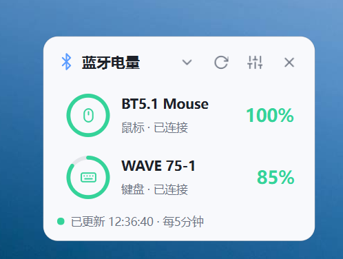
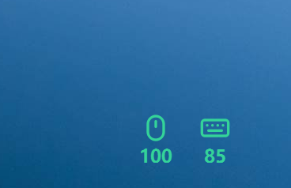

# 蓝牙电量悬浮窗 / Bluetooth Battery Widget

一个运行在 Windows 桌面上的轻量小组件：把已连接的蓝牙设备（鼠标、键盘、耳机等）电量常驻在屏幕一角，随时一眼看到。

---

## 中文说明

### 设计初衷

Windows 电脑连接蓝牙设备后，系统本身并没有提供一个方便查看设备剩余电量的桌面小组件或悬浮窗。工作中常常是正用到一半，鼠标、键盘或耳机突然没电才发现电量早该留意了。

这个小程序就是为此而生：把蓝牙设备电量做成一个可拖拽、可隐藏、可置顶的桌面悬浮窗，配合系统托盘常驻，电量变化随时可见，低电早有准备。

### 功能特性

- **桌面悬浮窗实时显示电量**：读取已连接 BLE 设备的 GATT 电池服务（0x180F），后台线程定时刷新，不卡界面
- **三种显示模式**，托盘菜单或设置中一键切换：
  - **详细模式**：设备列表，含设备类型图标、名称、状态与百分比
  - **紧凑模式**：只横向排列电量圆环，节省空间
  - **精简模式**：只剩两枚小圆环（固定绿色主题），双击圆环即可手动刷新
- **系统托盘常驻**：单击/双击托盘图标显示或隐藏悬浮窗，右键菜单可快速切换置顶、精简模式、开机自启等
- **丰富的外观设置**：深色 / 浅色 / 跟随系统主题、自定义强调色、悬浮窗不透明度、置顶开关
- **设备过滤与个性化**：只显示已连接设备、单独隐藏某台设备、是否显示本机电池；每台设备可手动指定图标类型（鼠标 / 键盘 / 耳机 / 音箱 / 手表 / 手写笔）
- **电量颜色分级**：电量大于 50% 为绿色，≤50% 为黄色，≤20% 红色提醒，充电中为蓝色，读不到时为灰色
- **开机自启**：通过注册表 `HKCU\...\Run` 实现，单实例运行（重复启动会提示已在运行）
- **设置实时预览**：在设置对话框里调整外观选项时，悬浮窗即时同步变化；点「取消」则还原，不写入配置
- **高 DPI 适配**：按 Per-Monitor V2 模式运行，在 100%–200% 缩放的高分屏上文字和图标都清晰

### 三种使用模式

| 详细模式 | 紧凑模式 | 精简模式 |
| :------: | :------: | :------: |
|  |  |  |

### 使用方式

**方式一：直接运行打包好的 exe（推荐）**

双击 `蓝牙电量悬浮窗.exe` 即可。程序常驻系统托盘，配置文件保存在 `%APPDATA%\BtBatteryWidget\config.json`。
开机自启：托盘右键菜单勾选「开机自动启动」。

**方式二：通过 VBS 脚本静默启动（不弹黑框）**

双击 `启动悬浮窗.vbs`。脚本内第一行 `pythonw` 路径可按需修改为你自己的 Python 环境。

**方式三：从源码运行**

```bash
pip install -r requirements.txt   # 仅需 PySide6>=6.8,<7
python main.py
```

### 技术实现

- Python 3 + PySide6（Qt 6）
- 电量读取：内嵌 PowerShell 脚本经 Windows Runtime (WinRT) 枚举 BLE 设备并读取 GATT 电池服务特征值，作为子进程异步执行，不阻塞 UI
- 配置持久化：JSON 写入 `%APPDATA%\BtBatteryWidget\config.json`；开机自启写注册表 `HKCU\Software\Microsoft\Windows\CurrentVersion\Run`
- 打包：PyInstaller（`--onefile --windowed`）

---

## English

### Why I built this

When you pair a Bluetooth mouse, keyboard or headset on Windows, the operating system itself gives you no desktop widget or floating overlay to glance at the battery level. Far too often a device dies mid-work before you ever noticed the battery running low.

This tiny app fixes exactly that: it puts Bluetooth device battery levels on a draggable, hideable, always-on-top desktop widget, living quietly in the system tray so you always know how much power is left.

### Features

- **Always-visible battery levels** for connected BLE devices (GATT Battery Service 0x180F), refreshed on a background timer without freezing the UI
- **Three display modes**, switchable from the tray menu or settings:
  - **Detailed mode**: device list with type icon, name, status and percentage
  - **Compact mode**: horizontal battery rings only, to save space
  - **Minimal mode**: just two small rings (fixed green accent), double-click a ring to refresh manually
- **System tray resident**: single/double-click toggles the widget; right-click menu exposes always-on-top, minimal mode, autostart, refresh and quit
- **Appearance options**: dark / light / follow-system theme, custom accent color, adjustable opacity, always-on-top
- **Device filtering**: show connected-only devices, hide specific devices, include or exclude the laptop battery; per-device icon override (mouse / keyboard / headphones / speaker / watch / pen)
- **Color-coded levels**: green above 50%, yellow ≤50%, red ≤20%, blue while charging, gray when unreadable
- **Autostart** via the `HKCU\...\Run` registry key; single-instance guard
- **Live settings preview**: appearance tweaks apply to the widget in real time; cancelling rolls back without saving
- **High-DPI aware** (Per-Monitor V2), crisp on scaled displays

### The three modes

| Detailed | Compact | Minimal |
| :------: | :-----: | :-----: |
|  |  |  |

### Usage

**Option 1 — run the packaged exe (recommended)**

Double-click `蓝牙电量悬浮窗.exe`. It stays in the system tray; configuration is stored at `%APPDATA%\BtBatteryWidget\config.json`. Enable autostart from the tray right-click menu.

**Option 2 — silent launch via VBS (no console window)**

Double-click `启动悬浮窗.vbs`. Edit the `pythonw` path inside to match your own Python environment if needed.

**Option 3 — run from source**

```bash
pip install -r requirements.txt   # requires only PySide6>=6.8,<7
python main.py
```

### Implementation notes

- Python 3 + PySide6 (Qt 6)
- Battery reading: an embedded PowerShell script enumerates BLE devices through the Windows Runtime (WinRT) and reads the GATT Battery Service characteristic; it runs as an async subprocess so the UI stays responsive
- Configuration: JSON at `%APPDATA%\BtBatteryWidget\config.json`; autostart via the registry `HKCU\Software\Microsoft\Windows\CurrentVersion\Run` key
- Packaging: PyInstaller (`--onefile --windowed`)

---

## 作者 / Author

王雪豪 findaxh@outlook.com

## 许可证 / License

Apache License Version 2.0

## AI 协助声明 / AI Assistance

本项目使用 Codex / 豆包 APP 协助开发，账号：https://findaxh@outlook.com / wangxuehao2024@163.com